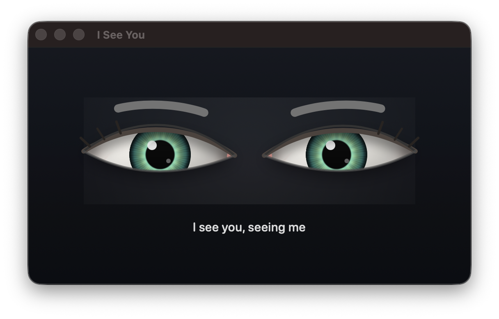
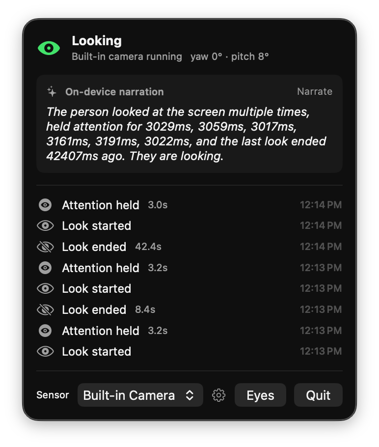

# i-see-you-see-me

A real-time presence and attention sensing platform built on the [OAK-D Lite](https://shop.luxonis.com/products/oak-d-lite) depth camera — with attention math and on-device AI narration running natively on macOS.

Built for the WWDC26 YC hackathon.

<p align="center">
  
</p>
<p align="center"><em>The eyes wander idly until the presence engine says you're looking — then they look back.</em></p>

## Quick Start

```bash
# Menu bar app (macOS 26+, Apple Silicon)
cd app && MENU_BAR_APP=1 ./Scripts/package_app.sh release && open ISeeYou.app

# OAK-D sensor service (optional — app falls back to the built-in camera)
cd sensor && uv sync && uv run oak-sensor          # or --mock without hardware
```

Then pick "OAK-D Lite" in the menu bar app's sensor picker.

## How It Works

```
OAK-D Lite ──(DepthAI, Python)──► frames + depth over WebSocket ─┐
                                                                 ├─► Vision framework head pose
Built-in camera ──(AVFoundation)─────────────────────────────────┘        │
                                                                          ▼
                                                  AttentionEngine (hysteresis + dwell timers)
                                                                          │ semantic events
                                                                          ▼
                                      menu bar UI + on-device Foundation Models narration
```

- **Sensors produce observations, never interpretations** — the Python service ships JPEG frames and a median depth scalar, nothing else.
- **Attention estimation is a swappable protocol** — today it's Vision-framework head pose (`VisionHeadPoseEstimator`); the WWDC26 multimodal Foundation Models estimator ([MultimodalAttentionEstimator.swift](app/Sources/ISeeYou/Narration/MultimodalAttentionEstimator.swift)) compiles under the Xcode 27 SDK and drops in behind the same protocol on macOS 27.
- **Consumers see only semantic events** (`person_entered`, `glance`, `attention_held`, …) — and the narration layer proves it: Apple's on-device foundation model describes your engagement from the event log alone, never seeing a single frame.

The OAK-D Lite is treated as a smart sensor that produces observations. The host software is responsible for interpretation, emitting high-level semantic events like `look_started`, `attention_held`, and `person_entered` — never raw landmarks or depth maps.

<p align="center">
  
</p>
<p align="center"><em>The menu bar panel: live state, head pose, the event feed — and the on-device model narrating it all from events alone.</em></p>

## Goals

Answer questions like:

- Is someone present?
- Where are they located relative to the device?
- Are they looking at the device?
- How long have they been paying attention?
- Did they glance briefly or intentionally engage?
- Are they approaching or moving away?

## Hardware

- **Camera:** OAK-D Lite (Luxonis) — 1080p RGB, stereo depth, on-device AI inference over USB-C
- **Primary dev machine:** MacBook Air M4
- **Secondary compute:** Mac Mini M4 Pro (64 GB) for model experimentation, logging, training

## Software Stack

In use today:

- **DepthAI (v3 API)** — OAK-D camera control, stereo depth acquisition, pipeline management ([sensor/](sensor/))
- **OpenCV** — JPEG encoding and frame manipulation in the sensor service
- **Vision framework** — face detection, head pose (yaw/pitch/roll), eye landmarks, and blink detection, on-device (`VisionHeadPoseEstimator`)
- **Foundation Models** — Apple's on-device LLM narrates the event stream (macOS 26); a multimodal estimator is staged for macOS 27

Still under evaluation for the gaze-estimation upgrade: learned gaze models (e.g. L2CS-Net via ONNX), MediaPipe face mesh, and VLM-class approaches. Traditional geometry-based approaches are evaluated against learned ones for latency-sensitive tasks — newer is not assumed to be better.

## Event Stream

The platform emits high-level events. Example shapes:

```json
{ "event": "look_started" }
{ "event": "look_ended" }
{ "event": "glance" }
{ "event": "attention_held", "duration_ms": 3500 }
{ "event": "person_entered" }
{ "event": "person_left" }
```

Consumer-facing API (illustrative):

```swift
presenceEngine.subscribe { event in
    switch event {
    case .attentionHeld: ...
    case .lookStarted: ...
    }
}
```

## Initial Success Criteria

| Capability | Target |
|---|---|
| Presence detection | >99% reliability indoors |
| Head tracking (location, orientation, distance) | <100 ms latency |
| Attention detection | Reliable with glasses, stable under office lighting, low false positives, low jitter |
| Engagement classification | Distinguish passing glance / short look / focused attention |

## Calibration (planned)

The system will support calibration of arbitrary targets (monitors, e-ink displays, wall panels, appliances, kiosks). A target is declared like:

```json
{ "target": "left_monitor" }
```

…and the system estimates whether attention is directed at it. Today, attention is reported relative to the camera only.

## Architecture Principles

- **Sensor first** — the OAK-D Lite produces observations; it does not contain application logic.
- **Event driven** — applications consume semantic events, not raw vision data.
- **Low latency** — a slightly less accurate answer in 50 ms beats a perfect answer in 500 ms.
- **Modular** — face detector, gaze estimator, attention classifier, and event generator should each be swappable.

## Future Applications

The current objective is the reusable sensing platform — not the apps built on top. Downstream possibilities include:

- Attention-aware notification displays
- Smart e-ink status boards
- Desktop presence detection / auto-hide UI
- Home automation triggers
- Occupancy sensing
- Accessibility interfaces
- Health and wellness monitoring
- Context-aware productivity systems

## Status

Working end-to-end. The macOS menu bar app ([app/](app/), SwiftPM, macOS 26+) runs the full pipeline: Vision-framework head pose estimation, the `AttentionEngine` state machine (hysteresis + dwell timers), the semantic event feed, on-device Foundation Models narration, and the shader-rendered eyes window. The Python sensor service ([sensor/](sensor/)) streams OAK-D Lite frames and depth over WebSocket, with a `--mock` mode that runs the whole stack without hardware.

Not done yet:

- **Calibration of arbitrary targets** — attention is currently relative to the camera only
- **Learned gaze estimation** — head-pose geometry is the current signal; eye-gaze models are still under evaluation
- **Test suite** — no automated tests checked in yet
- **macOS 27 multimodal estimator** — [MultimodalAttentionEstimator.swift](app/Sources/ISeeYou/Narration/MultimodalAttentionEstimator.swift) compiles under the Xcode 27 SDK but is gated off until macOS 27

See [docs/PLAN.md](docs/PLAN.md) for the phased plan and [docs/DEMO.md](docs/DEMO.md) for the demo walkthrough.
